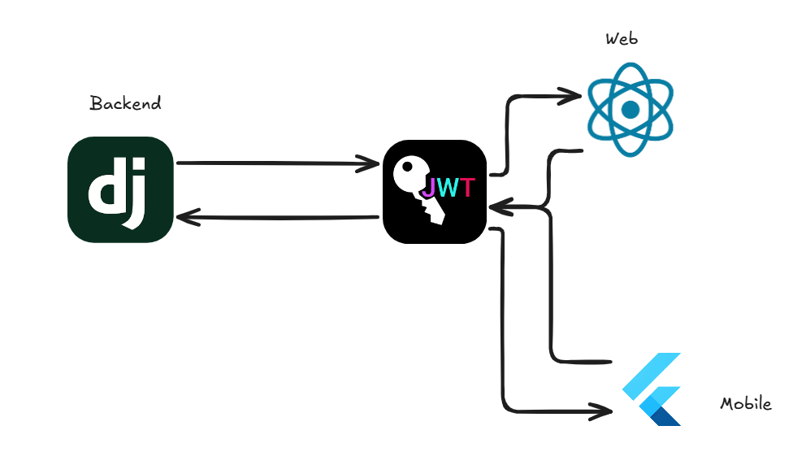

# JWT

Temos que a aplicação vai ter sua interface de uso desenvolvida em react para o uso web, e do gerente, 
mas também vai ter sua versão mobile desenvolvida em flutter para que seja usada em segundo plano, e para
que seja possível com que os dados de rastrio sejam feitos de maneira livre, e de maneira sem que gere 
atrito aos usuários de maior volume do sistema. 

Temos que toda a parte de autênticação vai ser feita com o uso de JWT, que é uma tecnologia que responsabiliza o client-side
pela autenticação e autorização do uso e das features que o usuário pode ter dentro do sistema. Com isso, temos que o funcionamento pode ser 
dado por:



Com isso, temos que três endpoints dentro do back-end vão ser responsáveis por fazer com que a validação desses jwt sem feita. Não somente a 
validação, mas como a geração desses tokens, e o refresh, para que eles tenham constantemente uma vida útil dentro do período de uso do app 
no sistema o qual está sendo implementado. 

## Endpoints

Com isso, temos que os endpoins responsáveis por fazer essas validação, refresh, e gerar os tokens para os usuários são:

```
/auth/token/
/auth/token/refresh/
/auth/token/verify/
```
Cada um desses endpoints é responsável por uma coisa, e eles tem suas funcionalidades definidas, assim como seus retornos, e eles podem ser vistos
dentro da api, por meio da sua interface.

Com isso, temos que os pacotes que podemos utilizar dentro do flutter, para fazer o manejamento correto e eficiente desse token são: `jwt_decode` e `flutter_secure_storage`, eles dois são responsáveis por decodificar as informações presentes dentro do jwt, e por fazer um armazenamento seguro de dados 
sensíveis como o próprio jwt respectivamente.

Por outro lado, temos que dentro do react, para gerenciarmos os tokens de jwt e usarmos eles dentro do nosso desenvolvimento, podemos 